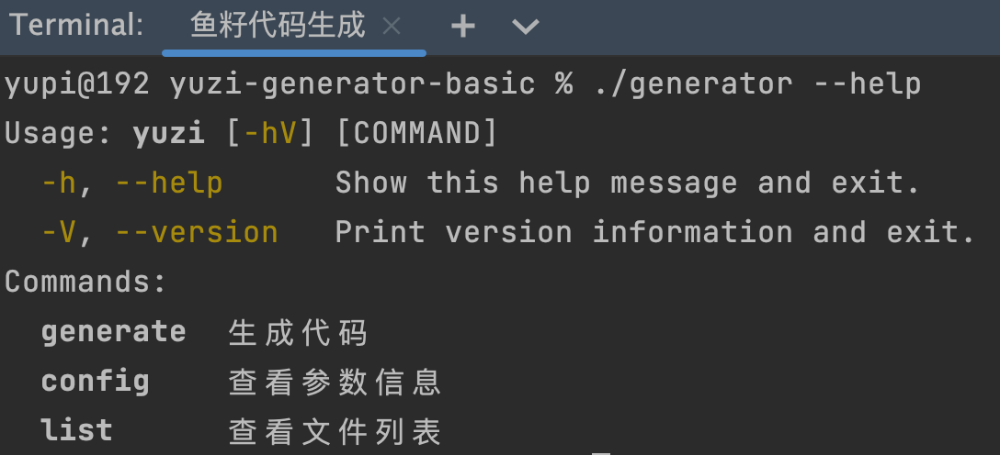

## 项目介绍
本次项目依然是从 0 到 1 带大家开发，会遵循企业项目开发的标准流程：
需求分析 => 技术选型 => 项目设计 => 项目初始化 => Demo 编写 => 前后端开发实现 => 测试验证 => 部署上线，带大家一步步完成整个项目。

项目介绍
这次要带大家做的是一个非常有趣又实用的项目，基于 React + Spring Boot + Vert.x 响应式编程的 定制化代码生成项目 。
1）第一阶段，我会带大家制作属于自己的 本地代码生成器 ，是一个 基于命令行的脚手架 ，能够根据用户的交互式输入快速生成特定代码。

2）第二阶段，让我们上升一个层次，带大家开发 制作代码生成器的工具 。比如你有一段常用的项目代码，使用该工具，可以快速把项目代码制作为代码生成器，将是提高工作效率的大杀器！

3）第三阶段，让我们再上升一个层次，带大家开发 在线代码生成器平台 ！你可以在平台上制作发布自己的代码生成器，还可以在线使用别人的代码生成器，甚至可以共享协作！

项目背景
这也是一个需求分析的过程，我主要考虑的是：
学习意义：
1)教程资料少：网上虽然有现成的项目模板，但基本都是别人封装好的，只能按作善的要求生成，并且缺少项目教程：,而本项目不仅带大家做自己的代码生成器，还会进2步扩展，打造制作自定义代码生成器的工具和平台。3)能学到东西：不再是增删改查的项目，而是包含了大量的实际业务场景，系统设计和解决方案。4)有区分度：区别于传统web应用，项目涉及命令行应用，响应式编程，性能优化的入门及实战，给你的简历增加竞争力。

解决的问题：
代码生成器本身的作用就是自动生成常见，重复性的代码片段，解决重复编码，效率低下的问题2)虽然网上有很多代码生成器，但都是别人制作封装好的，很多时候还是无法满足实际开发的定制化需求（比如要在每个类上增加特定的注解和注释）.这也是为什么明明有代码生成器，很多开发者还是会抱怨自己的工作总是复制贴，编写重复的代码，天天rud(增删改查）.如果能够有一个工具帮助开发者快速定制属于自己的代码生成器，那么将进一步提高开发效率。3)在团队开发中，要生成的代码可能是需要频繁变化和持续更新维护的。如果有一个线上平台来维护多个不同的代码生成器，支持在线编辑和共享生成器，在提高开发效率的同时，将有利于协作共建，打造更高质量的代码生成品

实际应用：
举例一些代码生成的实际应用场景，我们将通过本项目进行解决：1)经常做算法题目的同学，可能需要一套javaacm代码输入模板，能够支持多种不同输入模式（比如单次读取和循环）.2)经常开发新项目的同学，可能需要一赛初始化项目模板代码，比如一键生成controller层代码（替换其中的对象）,整合redis和mysql依赖等。)甚至可以制作项目"换皮"工具，支持一键给网络热门项目换皮（比如替换项目的名称，logo等）

需求分析(重要的是调研) => 技术选型（springboot+react框架） => 项目设计（业务流程+实现思路+关键问题）

## 开发过程和笔记记录
### 12.26 搭建好项目结构和示例模板  完成静态文件拷贝
1. 项目初始化，对于示例模版统一放到一个文件夹管理
2. 利用hutool的文件工具类实现文件夹的拷贝，静态文件生成（Hutool 官方文档：https://www.hutool.cn/ ）
3. System.getProperty("user.dir") 获取当前项目路径是打开项目的路径有有区分

### 01.04 完成动态文件拷贝（模版引擎FreeMarker）
1. 实践一个FreeMarker的demo项目，熟悉模版引擎开发
2. 利用FreeMarker的API实现动态文件拷贝
3. 方法封装起来，动态可配置传参即可

### 01.04 命令行界面的开发（Picocli框架）
1. 命令行程序的几个优点：
    ● 不依赖于特定的图形界面，非常轻量
    ● 通常可以直接在操作系统自带的终端环境中运行
    ● 可以和用户交互、给用户输入引导和帮助手册
    ● 内置一些快捷操作（比如查看历史命令、上下切换命令）
    还有一个最大的优点 —— 简单直接，比如复制粘贴别人写好的命令就能执行，而不用像使用网页一样点击多次，非常符合程序员的使用（偷懒）习惯，less is more！
2. 遇到不会的，先做充分的调研（谷歌，chatGPT,github等等），比较优劣势，得到自己需要的
3. interactive = true 交互式输入【可选交互式arity="0..1" 强制交互式】
4. 子命令 【声明式 编程式】
5. 设计模式【命令模式】
6. 打包成jar包 封装脚本运行jar包
   使用命令模式的几个要素：
   ● 命令：GenerateCommand 等子命令中实现的 Runnable（或 Callable）接口
   ● 具体命令：每个子命令类
   ● 调用方：CommandExecutor 命令执行器类
   ● 接受者：代码生成器 MainGenerator 类（实际执行功能的类）
   ● 客户端：主程序 Main

